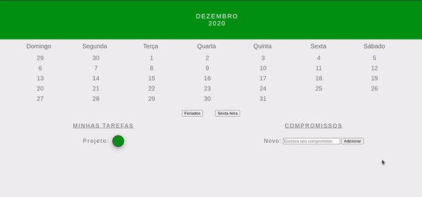

# Boas vindas ao exercício Desafio Técnico: Calendário Tryber

Chegou o momento em que você vai criar o seu próprio calendário da Trybe! 🚀

Com esse calendário você vai poder adicionar feriados, compromissos e ainda adicionar as tarefas que você precisa realizar!

Para isso será necessário colocar em prática todos os seus conhecimento de HTML, CSS e JavaScript!

## Termos e acordos

Ao iniciar este exercício, você concorda com as diretrizes do Código de Conduta e do Manual da Pessoa Estudante da Trybe.

## Entregáveis

<details>
  <summary><strong>🤷🏽‍♀️ Como entregar</strong></summary><br />

  Para entregar o seu exercício você deverá criar um *Pull Request* neste repositório.

  Lembre-se que você pode consultar nosso conteúdo sobre [Git & GitHub](https://app.betrybe.com/course/4d67f5b4-34a6-489f-a205-b6c7dc50fc16/) e nosso [Blog - Git & GitHub](https://blog.betrybe.com/tecnologia/git-e-github/) sempre que precisar!
</details>

<details>
  <summary><strong>👨‍💻 O que deverá ser desenvolvido</strong></summary><br />
<br />

Desafio Técnico: Calendário Tryber

Você irá desenvolver um calendário semelhante ao da imagem abaixo.



O projeto já possui os arquivos `.html`, `.css` inicias. Fique à vontade para soltar a criatividade e alterar o arquivo `.css` como desejar!

O objetivo deste desafio é colocar em prática o que você aprendeu sobre DOM, seletores, manipulação de elementos HTML e Eventos em JavaScript. Por isso, você deve fazer os exercícios utilizando apenas código JavaScript, o qual deve ser inserido no arquivo `scripts.js`. Não altere o conteúdo do arquivo `index.html`.

</details>

<br />

# Orientações
  
<details>
<summary><strong>‼ Antes de começar a desenvolver</strong></summary><br />

1. Clone o repositório

- Use o comando: `git clone git@github.com:tryber/sd-030-a-exercise-tryber-calendar.git`
- Entre na pasta do repositório que você acabou de clonar:
  - `cd sd-030-a-exercise-tryber-calendar`

2. Instale as dependências e inicialize o projeto

- Instale as dependências:
  - `npm install`

3. Crie uma branch a partir da branch `main`

- Verifique que você está na branch `main`
  - Exemplo: `git branch`
- Se você não estiver, mude para a branch `main`
  - Exemplo: `git checkout main`
- Agora crie uma branch à qual você vai submeter os `commits` do seu projeto:
  - Você deve criar uma branch no seguinte formato: `nome-sobrenome-nome-do-projeto`;
  - Exemplo: `git checkout -b maria-soares-exercise-dom-manipulation`

4. Crie na raiz do projeto os arquivos que você precisará desenvolver:

- Verifique que você está na raiz do projeto:
  - Exemplo: `pwd` -> o retorno vai ser algo tipo _/Users/maria/code/**sd-030-a-exercise--calendar**_
- Crie os arquivos index.html e style.css:
  - Exemplo: `touch index.html style.css`

5. Adicione as mudanças ao _stage_ do Git e faça um `commit`

- Verifique que as mudanças ainda não estão no _stage_:
  - Exemplo: `git status` (devem aparecer listados os novos arquivos em vermelho)
- Adicione o novo arquivo ao _stage_ do Git:
  - Exemplo:
    - `git add .` (adicionando todas as mudanças - _que estavam em vermelho_ - ao stage do Git)
    - `git status` (devem aparecer listados os arquivos em verde)
- Faça o `commit` inicial:
  - Exemplo:
    - `git commit -m 'iniciando o projeto. VAMOS COM TUDO :rocket:'` (fazendo o primeiro commit)
    - `git status` (deve aparecer uma mensagem tipo _nothing to commit_ )

6. Adicione a sua branch com o novo `commit` ao repositório remoto

- Usando o exemplo anterior: `git push -u origin maria-soares-exercise-dom-manipulation`

7. Crie um novo `Pull Request` _(PR)_

- Vá até a página de _Pull Requests_ do [repositório no GitHub](https://github.com/tryber/sd-030-a-exercise--calendar/pulls)
- Clique no botão verde _"New pull request"_
- Clique na caixa de seleção _"Compare"_ e escolha a sua branch **com atenção** - Coloque um título para o seu _Pull Request_
  - Exemplo: _"Cria tela de busca"_
- Clique no botão verde _"Create pull request"_

- Adicione uma descrição para o _Pull Request_, um título nítido que o identifique, e clique no botão verde _"Create pull request"_

 

- Volte até a [página de _Pull Requests_ do repositório](https://github.com/tryber/sd-030-a-exercise--calendar/pulls) e confira que o seu _Pull Request_ está criado

</details>
<details>
<summary><strong>⌨️ Durante o desenvolvimento</strong></summary><br />

- Faça `commits` das alterações que você fizer no código regularmente pois assim você garante visibilidade para o time da Trybe e treina essa prática para o mercado de trabalho :) ;
- Lembre-se de sempre após um (ou alguns) `commits` atualizar o repositório remoto;
- Os comandos que você utilizará com mais frequência são:

1. `git status` _(para verificar o que está em vermelho - fora do stage - e o que está em verde - no stage)_;

2. `git add` _(para adicionar arquivos ao stage do Git)_;

3. `git commit` _(para criar um commit com os arquivos que estão no stage do Git)_;

4. `git push -u origin nome-da-branch` _(para enviar o commit para o repositório remoto na primeira vez que fizer o `push` de uma nova branch)_;

5. `git push` _(para enviar o commit para o repositório remoto após o passo anterior)_.

</details>
  
<details>
<summary><strong>🕵🏿 Revisando um pull request</strong></summary><br />

Use o conteúdo sobre [Code Review](https://app.betrybe.com/course/real-life-engineer/code-review) para te ajudar a revisar os _Pull Requests_.

</details>

<details>
  <summary><strong>🤝 Depois de terminar o desenvolvimento (opcional)</strong></summary><br />

Após a solução dos exercícios, abra um PR no seu repositório forkado e, se quiser, mergeie para a `main`. Sinta-se à vontade!

**Atenção!**: Ao criar o PR,  você irá se deparar com essa tela:


É necessário realizar uma mudança. Para isso, clique no _base repository_ como na imagem abaixo:


Mude para o seu repositório. Seu nome estará na frente do nome dele, por exemplo: `antonio/TicTacToe`. Depois desse passo a página deve ficar assim:


Agora, basta criar o PULL REQUEST clicando no botão `Create Pull Request`.

> 💡 Realize esse processo para cada PR que abrir.

</details>

<details>
  <summary><strong>🛠 Testes e Cypress</strong></summary><br />

O Cypress é uma ferramenta de teste de front-end desenvolvida para a web. Antes de utilizá-lo, certifique-se de ter executado o comando `npm install` dentro do projeto.

Você pode rodar o Cypress localmente para verificar se seus requisitos estão passando, para isso execute um dos seguintes comandos:

1. Para executar os testes apenas no terminal:

```bash
npm test
```

2. Para executar os testes e vê-los rodando em uma janela de navegador:

```bash
npm run cypress:open
```

***ou***

```bash
npx cypress open
```

Após executar um dos comandos acima, uma janela de navegador será aberta e, então, você poderá escolher o teste a ser executado (project.spec.js) ou escolher `Run all specs` para executar todos os testes

Veja [este vídeo](https://vimeo.com/539240375/a116a166b9)  para ver como rodar o Cypress localmente 😉🎙

* Siga este passo a passo para verificar os **detalhes da execução do avaliador**:

  * Na página do seu _Pull Request_, acima do "botão de merge", procure por _**"Evaluator job"**_ e clique no link _**"Details"**_;

  * Na página que se abrirá, clique na linha _**"Cypress evaluator step"**_ ;

  * Analise os resultados a partir da mensagem _**"(Run Starting)"**_;

  * Caso tenha dúvidas, consulte [este vídeo](https://vimeo.com/420861252) ou poste a sua dúvida no _Slack_.

⚠️ **O avaliador automático não necessariamente avalia seu projeto na ordem em que os requisitos aparecem no readme. Isso acontece para deixar o processo de avaliação mais rápido. Então, não se assuste se isso acontecer, ok?**

* Contudo, tenha em mente que **nada além do que for pedido nos requisitos será avaliado**. _Esta é uma oportunidade de você exercitar sua criatividade e experimentar com os conhecimentos adquiridos._

O não cumprimento de um requisito, total ou parcialmente, impactará em sua avaliação.

</details>

<br />

# Requisitos

## Exercício 1 - Crie um calendário dinamicamente

<details>
  <summary>
    O array <code>decemberDaysList</code> contém os dois últimos dias de novembro e os dias do mês de dezembro. Sua função deve criar dinamicamente cada dia do calendário e os adicionar dentro da tag <code>ul</code>.
  </summary>

> **Observação 🔎:** Note que os dias 29 e 30 de novembro estão no array, pois representam respectivamente Domingo e Segunda-feira.

```js
const decemberDaysList = [29, 30, 1, 2, 3, 4, 5, 6, 7, 8, 9, 10, 11, 12, 13, 14, 15, 16, 17, 18, 19, 20, 21, 22, 23, 24, 25, 26, 27, 28, 29, 30, 31];
```

</details>

<details>
  <summary><strong>O que será testado:</strong></summary>

- A tag <code>ul</code> deve conter o `id` `'days'`;
- Os dias devem estar contidos em uma tag `<li>`, e todos devem ter a classe `day`. Ex: `<li class="day">3</li>`;
- Os dias 24, 25 e 31 são feriados e, além da classe `day`, devem conter também a classe `holiday`. Ex: `<li class="day holiday">24</li>`;
- Os dias 4, 11, 18 e 25 são sextas-feiras. Eles devem conter a classe `day` e a classe `friday`. Ex: `<li class="day friday">4</li>`.

</details>

## Exercício 2 - Implemente uma função que muda a cor de fundo dos dias que possuem a classe `"holiday"`

Adicione ao botão `"Feriados"` um evento de `"click"` que altere a cor de fundo dos dias que possuem a classe `"holiday"`.

> **De olho na dica 👀:** É interessante que esse botão possua também a lógica inversa. Ao ser clicado novamente, ele retorna à configuração inicial com a cor "rgb(238,238,238)".

<details>
  <summary><strong>O que será testado:</strong></summary>

- Ao clicar no botão "Feriados", a cor de fundo dos dias que possuem a classe "holiday" deve mudar;
- Ao clicar novamente no botão "Feriados", a cor de fundo dos dias que possuem a classe "holiday" deve voltar ao normal.

</details>

## Exercício 3 - Implemente uma função que modifica o texto exibido nos dias que são Sexta-feira

Adicione ao botão "Sexta-feira" um evento de "click" e modifique o texto a ser exibido nos dias que são sextas-feiras.

> **De olho na dica 👀:** É interessante que esse botão possua também a lógica inversa. Ao ser clicado novamente, ele retorna à configuração inicial exibindo os dias.

<details>
  <summary><strong>O que será testado:</strong></summary>

- Ao clicar no botão "Sexta-feira", o texto dos dias que são sexta-feira deve mudar;
- Ao clicar novamente no botão "Sexta-feira", o texto retorna ao normal.

</details>

## Exercício 4 - Implemente duas funções que criem um efeito de "zoom"

Ao passar o ponteiro do mouse em um dia do mês no calendário, o texto desse dia deve aumentar para `30px`, e quando o ponteiro do mouse sair do dia, o texto deve retornar ao tamanho original.

> **De olho na dica 👀:** Você pode utilizar a propriedade [event.target](https://developer.mozilla.org/en-US/docs/Web/API/Event/target).

<details>
  <summary><strong>O que será testado:</strong></summary>

- Ao passar o mouse sobre um dia do calendário, o texto desse dia deve aumentar;
- Ao tirar o mouse sobre um dia do calendário, o texto desse dia deve retornar ao tamanho original.

</details>

---

# Exercícios Bônus

## Exercício 5 - Implemente uma função que selecione uma tarefa

- Adicione um evento que ao clicar no elemento com a tag `<div>` referente à cor da sua tarefa, atribua a esse elemento a classe `selected`, ou seja, quando sua tarefa possuir a classe `selected` ela estará selecionada;
- Ao clicar novamente no elemento, a sua classe deverá voltar a ser somente `task`, ou seja, essa tarefa está deixando de ser uma tarefa selecionada.

<details>
  <summary><strong>O que será testado:</strong></summary>

- Ao clicar em uma tarefa, ela deve ser selecionada;
- Ao clicar novamente na tarefa, ela deve ser desmarcada.

</details>

## Exercício 6 - Implemente uma função que atribua a cor da tarefa ao dia do calendário

- Adicione um evento que, ao clicar em um dia do mês no calendário, atribua a esse dia a cor da legenda da sua tarefa selecionada;
- Ao clicar novamente no dia com a cor da legenda, a sua cor deverá voltar à configuração inicial `rgb(119,119,119)`.

<details>
  <summary><strong>O que será testado:</strong></summary>

- Ao clicar em uma tarefa com a classe `.task`, e clicar em um dia do mês no calendário com a classe `.day`, atribua a esse dia a cor da legenda da sua tarefa selecionada;
- Ao clicar novamente no dia com a cor da legenda, a sua cor deverá voltar à configuração inicial `rgb(119,119,119)`.

</details>

## Exercício 7 - Vamos adicionar compromissos ao seu calendário?

- Implemente uma função que, ao digitar um compromisso na caixa de texto com id `'task-input'`, adiciona o item à lista com id `'task-list'` ao clicar no botão com id `'btn-add'`;
- Se nenhum caractere for inserido no campo com id `'task-input'`, a função deve chamar um `alert` com uma mensagem de erro;
- Ao pressionar a tecla <kbd>Enter</kbd> o evento também deverá ser disparado.

> **De olho na dica 👀:** Você pode utilizar a propriedade [key](https://www.w3schools.com/JSREF/event_key_key.asp).

<details>
  <summary><strong>O que será testado:</strong></summary>

- Ao clicar no botão com id `'btn-add'`, com o texto `'25 - Natal'` na caixa de texto com id `'task-input'`, adiciona o item `'25 - Natal'` à lista com id `'task-list'`;
- Ao clicar no botão com id `'btn-add'`, sem nenhum caractere no campo com id `'task-input'`, a função deve chamar um `alert` com uma mensagem;
- Ao pressionar a tecla Enter, com o texto `'25 - Natal'` na caixa de texto com id `'task-input'`, adiciona o item `'25 - Natal'` à lista com id `'task-list'`.

</details>
